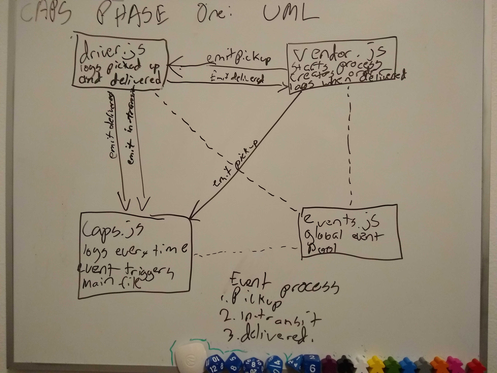

# CAPS

## Phase 1 Development

Frameworks required:

Node/NPM

How to use:

1. Create .env and populate with STORE
1. `npm i` in terminal to install dependencies (.env, faker, jest for testing)
1. run `node .` or `node caps.js` to start

## UML

